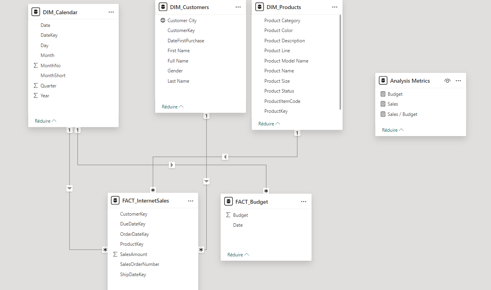
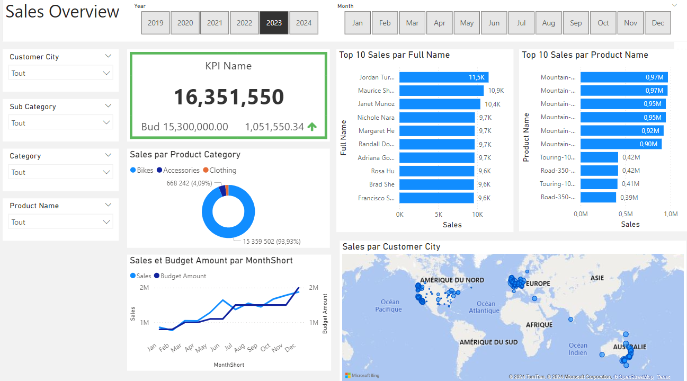
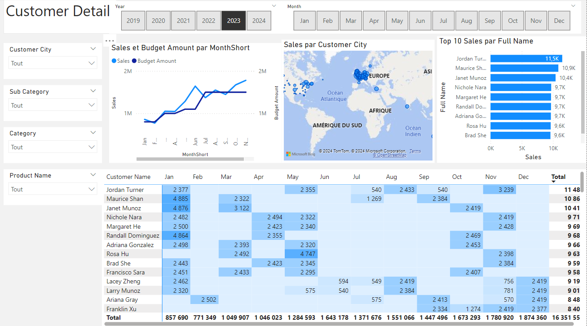
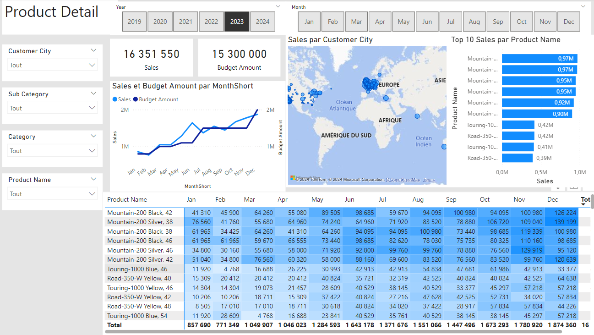

# Adventure-Work-Sales-Analysis-Power-Bi
## Project Overview
This project uses the **Adventure Works** dataset to create interactive dashboards for analyzing sales performance. The goal is to provide insights on customer behavior, product sales, and regional performance using **Power BI**.

---
## Business Request
The sales department requested an analysis of recent sales performance to help improve strategy and marketing efforts.

## User Story

| No. | As a (role)          | I want (request / demand)                        | So that I (user value)                                | Acceptance Criteria                                                  |
|-----|----------------------|--------------------------------------------------|-------------------------------------------------------|----------------------------------------------------------------------|
| 1   | Sales Manager         | To get a dashboard overview of internet sales    | Can follow which customers and products sell the best  | A Power BI dashboard which updates data once a day                   |
| 2   | Sales Representative  | A detailed overview of Internet Sales per Customer | Can follow up on customers who buy the most           | A Power BI dashboard that allows filtering for each customer         |
| 3   | Sales Representative  | A detailed overview of Internet Sales per Product | Can follow up on products that sell the most           | A Power BI dashboard that allows filtering for each product          |
| 4   | Sales Manager         | A dashboard overview of internet sales            | Follow sales over time against budget                 | A Power BI dashboard with graphs and KPIs comparing against budget   |


---

## Data Cleaning and Modeling
Data was imported from the Adventure Works database and cleaned using **SQL**. Key steps:
- Removed null values
- Standardized date formats
- Joined tables for customer and product data
### Dim Customer Table
 ```sql
    SELECT 
        c.customerkey AS CustomerKey, 
        c.firstname AS [First Name], 
        c.lastname AS [Last Name], 
        c.firstname + ' ' + lastname AS [Full Name], 
        CASE c.gender WHEN 'M' THEN 'Male' WHEN 'F' THEN 'Female' END AS Gender,
        c.datefirstpurchase AS DateFirstPurchase, 
        g.city AS [Customer City] -- Joined in Customer City from Geography Table
    FROM 
        [AdventureWorksDW2022].[dbo].[DimCustomer] as c
    LEFT JOIN dbo.dimgeography AS g ON g.geographykey = c.geographykey 
    ORDER BY 
        CustomerKey ASC -- Ordered List by CustomerKey 
```

--- 

### Dim Product Table
```sql
    SELECT 
        p.[ProductKey], 
        p.[ProductAlternateKey] AS ProductItemCode, 
        p.[EnglishProductName] AS [Product Name], 
        ps.EnglishProductSubcategoryName AS [Sub Category], -- Joined in from Sub Category Table
        pc.EnglishProductCategoryName AS [Product Category], -- Joined in from Category Table
        p.[Color] AS [Product Color], 
        p.[Size] AS [Product Size], 
        p.[ProductLine] AS [Product Line], 
        p.[ModelName] AS [Product Model Name], 
        p.[EnglishDescription] AS [Product Description], 
        ISNULL (p.Status, 'Outdated') AS [Product Status] 
    FROM 
        [AdventureWorksDW2022].[dbo].[DimProduct] as p
        LEFT JOIN dbo.DimProductSubcategory AS ps ON ps.ProductSubcategoryKey = p.ProductSubcategoryKey 
        LEFT JOIN dbo.DimProductCategory AS pc ON ps.ProductCategoryKey = pc.ProductCategoryKey 
    order by 
        p.ProductKey asc
```

### Dim Calendar Table
```sql
    SELECT 
        [DateKey], 
        [FullDateAlternateKey] AS Date, 
        [EnglishDayNameOfWeek] AS Day, 
        [EnglishMonthName] AS Month, 
        Left([EnglishMonthName], 3) AS MonthShort,
        [MonthNumberOfYear] AS MonthNo, 
        [CalendarQuarter] AS Quarter, 
        [CalendarYear] AS Year
    FROM 
        [AdventureWorksDW2022].[dbo].[DimDate]
    WHERE 
        CalendarYear >= 2019
```

### Dim Product Table
```sql
    SELECT 
        [ProductKey], 
        [OrderDateKey], 
        [DueDateKey], 
        [ShipDateKey], 
        [CustomerKey], 
        [SalesOrderNumber],
        [SalesAmount]
    FROM 
        [AdventureWorksDW2022].[dbo].[FactInternetSales]
    WHERE 
        LEFT (OrderDateKey, 4) >= YEAR(GETDATE()) -5
    ORDER BY
        OrderDateKey ASC
```

## Data Modeling
A relational **Data Model** was built in Power BI to connect sales, customers, and products for comprehensive analysis.
Below is a screenshot of the data model.

> 

## Sales Management Dashboard
The finished DashBoard With one page as an Overview, and two other pages focusing on combining table for necessary details and vizualisations to show sales over time per product and customer

> 

> 

> 